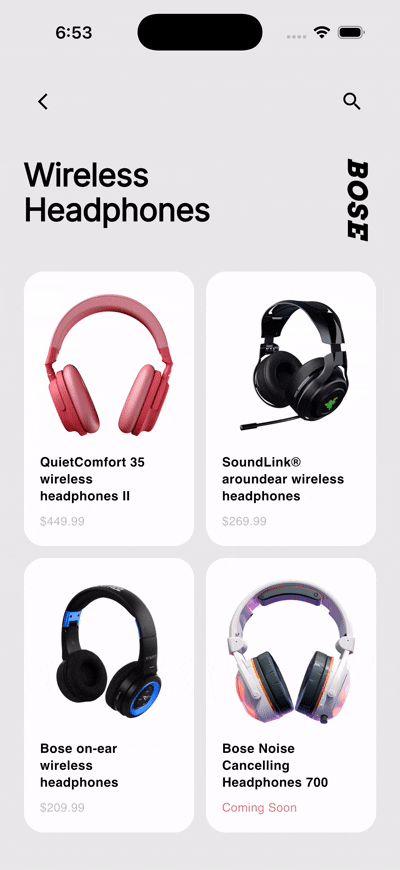

<div align="center">

# 🎧 Bose Headphones App UI

**Design to Code — Part 1**

A Flutter implementation of a sleek Bose Headphones app UI, recreated from a Dribbble design as part of my ongoing *Design to Code* series.



</div>

---

## 🎨 Original Design

This UI is based on the following Dribbble shot:

> **Bose Headphones App** by the original designer
> 🔗 [View on Dribbble](https://dribbble.com/shots/15441443-Bose-Headphones-App)

---

## 📖 About This Series

This is **Part 1** of my *Design to Code* series, where I pick beautiful UI designs from Dribbble and bring them to life using Flutter — focusing on smooth animations, clean layouts, and pixel-perfect details.

---

## ✨ What's Included

- Animated UI transitions
- Clean product-focused layout
- Flutter custom widgets

---

## 🚀 Run Locally

```bash
git clone https://github.com/yourusername/bose-headphones-ui.git
cd bose-headphones-ui
flutter pub get
flutter run
```

---

## 🛠 Built With

- [Flutter](https://flutter.dev/) — UI toolkit
- [Dart](https://dart.dev/) — Language

---

*This project is for learning and portfolio purposes only. All design credit goes to the original Dribbble artist.*
